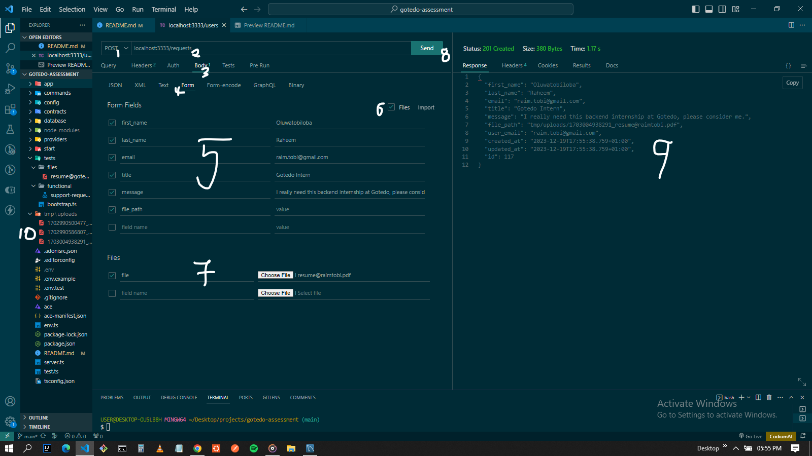
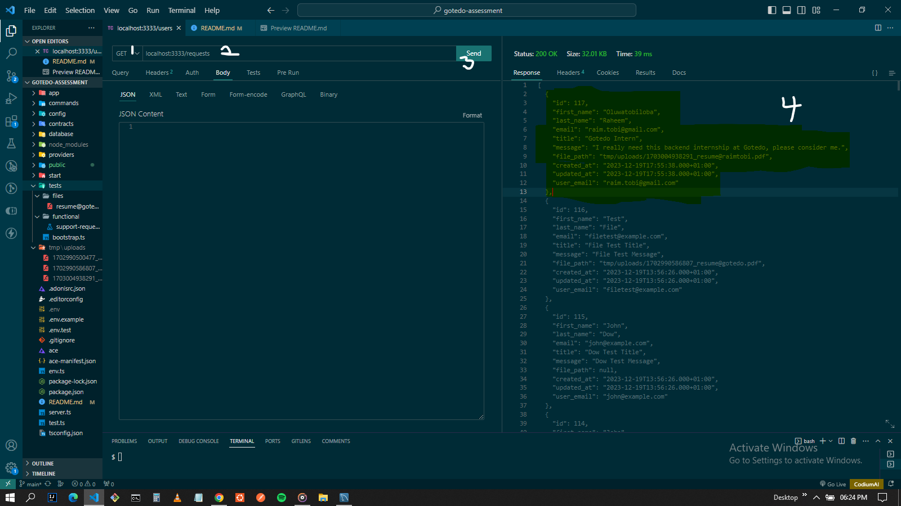
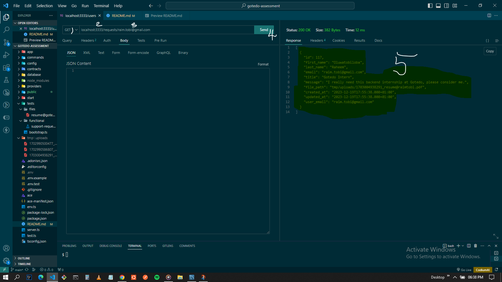
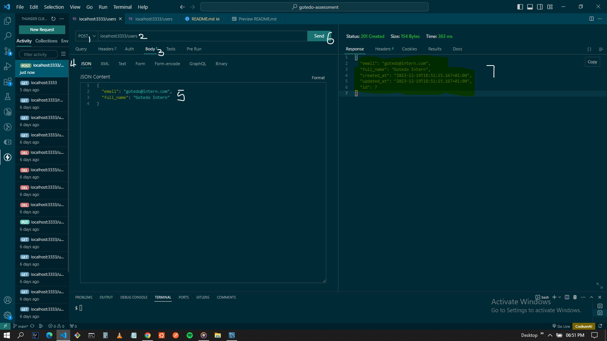

# Gotedo backend coding assessment

## Table of Contents

- [Problem Statement, Requirements and Approach](#problem-statement-requirements-and-approach)
- [Installation](#installation)
- [Testing](#testing)
- [Features](#features)
- [Usage](#usage)
- [Contributing](#contributing)
- [License](#license)

## Problem Statement, Requirements and Approach

`Problem`

You are part of the backend team saddled with the responsibility of developing the backend component of a simple customer support platform. Keep things very simple and don’t do what isn’t required. Do your best, but you aren’t expected to develop the application like an experienced professional.

`Requirements`

1. There is only one user-facing form and that is the support request form.
2. Customers are required to enter the following information per support request. Store the support request on a separate table.
	- First name,
	- Last name,
	- Email address,
	- Support message title,
	- Support message text (potentially a long text),
	- File (support just one file file upload)
3. Maintain a database table for users with the following required fields:
	- ID
	- Email address
	- Full name
4. A user can have many support requests. A support request can belong to only one user.
5. When a new support request is submitted, link the request to a user via the provided email address.
6. Write tests for handling of the support request submission.
	- Show that the support request was submitted and the data persisted.
	- Show that multiple support requests with the same email address is linked to the same user.
	- Show that the file is successful uploaded and stored.
7. Create a database diagram for all the tables with this [tool](https://dbdiagram.io/home) showing the indexes and foreign relationships.
8. Authentication/registration flow is not needed

`Approach `

1. You are expected to develop the backend with this [Adonisjs framework](https://adonisjs.com/). Follow [these instructions](https://docs.adonisjs.com/guides/installation) to setup the backend.
2. Feel free to use either MySQL or PostgreSQL as database engine. Follow these instructions to setup the [Lucid ORM](https://docs.adonisjs.com/guides/database/introduction).
3. Create routes for your backend using [Adonisjs Routing](https://docs.adonisjs.com/guides/routing).
4. Validate the submitted data with the [Adonisjs Validator](https://docs.adonisjs.com/guides/validator/introduction). [Reference](https://docs.adonisjs.com/reference/validator/schema/string).
5. Store the uploaded file to local drive using the basic [Adonisjs file handling](https://docs.adonisjs.com/guides/file-uploads).
6. Write tests for your backend Adonisjs/Japa test runner. See the [introduction](https://docs.adonisjs.com/guides/testing/introduction) and [HTTP tests](https://docs.adonisjs.com/guides/testing/http-tests). 
	- Testing file uploads [here](https://docs.adonisjs.com/guides/testing/http-tests#file-uploads) and [here](https://v2.japa.dev/docs/plugins/api-client#file-uploads).
	- Testing forms [here](https://docs.adonisjs.com/guides/testing/http-tests#file-uploads).


## Installation

`Prerequisites`

To install set up this project on your machine, you should have a nodejs, npm, and mysql (server + workbench (optional)) installed on your machine. Make sure you follow due process as required by your operating system.

After this, set up a new mysql database server connection on your local machine, taking note your credentials as this would be necessary for successfully connecting with this project.

`Project Setup`

- Clone repository
```bash
git clone https://github.com/raim-io/gotedo-assessment.git

```

- Navigate into the project directory
```bash
cd gotedo-assessment
```

- Install project dependencies
```bash
npm install
```
- create a `.env` file and copy the contents of `.env.example` file into the `.env` file, using this just as a template (you should replace/change values as required by your database setup)

- Start the application

```bash
node ace serve --watch
```


## Testing

As required by this assessment, there are 3 tests to be carried out for the handling of support request submission. These are to:

- Show that the support request was submitted and the data persisted.
- Show that multiple support requests with the same email address is linked to the same user.
- Show that the file is successful uploaded and stored.

The test scripts exists in `tests/functional/support-request.spec.ts`

To run the test scripts, make sure you are in the project's root directory, then run 
```bash
node ace test
```

## Features

As required by the assessment, the project's main feature is creating a user support request system (something like a complaint form) with various form fields. Other features includes:

- Registering a user to a database, with CRUD abilities on a user
- Linking requests to a single user via the email provided in the support request form
- Ability to upload a file per support request
- Auto creating a new user if a user with support request email does not exist in the User table


## Usage

For the ease of simplicity, i will be using ThunderClient VSCode extension to use/test these APIs

### Support Requests

#### `Create a support request`

1. Request type: `POST`
2. Endpoint: `/requests`
3. Request payload: `body`
4. Request format: `form` (json/application, form-data, ... are valid too)
5. Input request fields: (`first_name`, `last_name`, `email`, `title`, `message`)
6. Activate file field: `file`
7. Upload file: `file`
8. Send request
9. Recieve response asserting successful submission
10. Uploaded files appears in `tmp/uploads` directory



#### `Retrieve all created support requests`

1. Request type: `POST`
2. Endpoint: `/requests`
3. Send request
4. Recieve response asserting successful retrieval of all support requests, including the newly created one

`P.S`: No request body or parameter is needed for this execution



#### `Get support requests associated to a user via email`

1. Request type: `POST`
2. Endpoint: `/requests/:user_email`
3. Request payload: `parameter` (the associated user_email)
4. Send request
5. Recieve response asserting successful submission




### Users

#### `Create a new user`

1. Request type: `POST`
2. Endpoint: `/users`
3. Request payload: `body`
4. Request format: `json` (form, form-data, ... are valid too)
5. Input request fields: (`email`, `full_name`)
6. Send request
7. Recieve response asserting successful user creation



### `P.S:`
These are the usage primary functionality as required by the assessment. Note that other functionalities (secondary) like:

	- Deleting a support request
	- Updating a user
	- Deleting a user
	- Finding a user by ID

are readily available in the project, and it's appropriate usage can be understood with a quick glance through the routes and controllers.